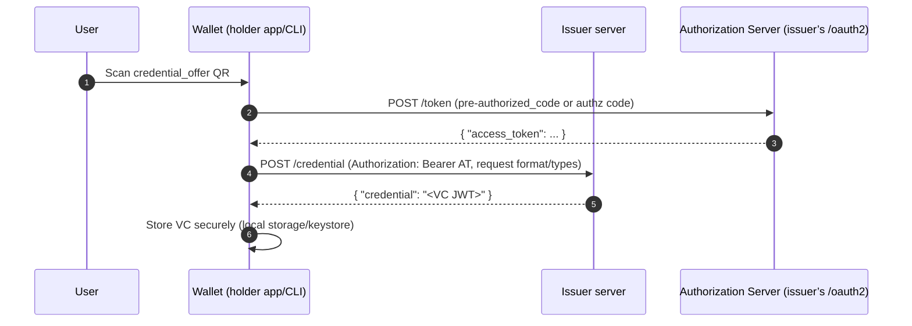
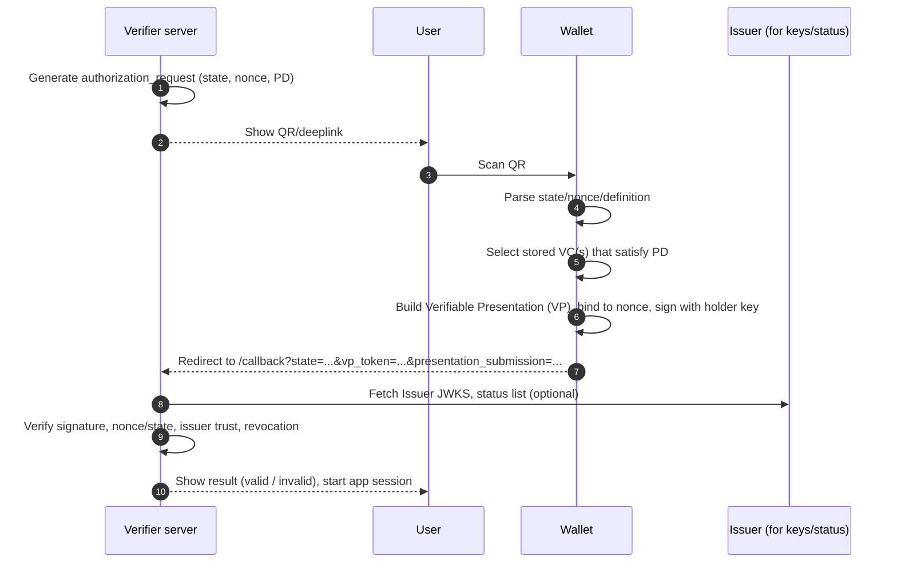

# vc-wallet-cli
VC Wallet CLI for development.

Issue
```
./gradlew :issue --args="--issuer http://localhost:8080 --code PREAUTH-123 --out wallet-vc.jwt"

Issuing from http://localhost:8080 with pre-authorized code PREAUTH-123 ...
Saved: wallet-vc.jwt
Issued VC (first 40 chars): <vc>
```
Present
```
./gradlew :present --args="--verifier http://localhost:9080 --vc wallet-vc.jwt"

AR: state=x nonce=y
URI: openid-vc://?client_id=https://verifier.example.com/callback&response_type=vp_token&redirect_uri=https://verifier.example.com/callback&nonce=y&state=y&presentation_definition_uri=https://verifier.example.com/pd/university-id
Verifier response: {"valid":true,"aud_ok":false,"state":"x","verified":[{"issuer":"https://issuer.example.com/issuer","subjectId":"did:example:holder123","types":["VerifiableCredential","UniversityID"],"studentId":"S1234567"}],"submission":"{}"}

```

Issuance

Presentation


Who orchestrates what?

Issuance (OID4VCI)
- Wallet scans a credential_offer QR/deeplink that you show somewhere (web/app).
- Wallet calls your AS /token using the pre-authorized code (and optional PIN) from the offer.
- Wallet calls your Issuer /credential with that access token.
- Issuer signs the VC and returns it to the wallet.
  Orchestrator: the wallet. Your Issuer just exposes the endpoints; no bash needed.

Presentation / Verification (OID4VP + PE)
- Verifier server creates a request (nonce, state, presentation_definition) and returns a deeplink/QR from /authorize-presentation.
- User scans the QR with their wallet.
- Wallet builds a VP that satisfies your definition and redirects to your Verifier /callback?vp_token=…&state=….
- Verifier checks state→nonce, verifies VC(s), applies policy, then establishes an app session.
- Orchestrator: the wallet (building/submitting the VP) and your verifier (tracking state/nonce and verifying on /callback). Your bash vp-token helper was only for local testing.
