# vc-wallet-cli
VC Wallet CLI for development.
```
./gradlew run

1) Issuance
Fetching access token...
Requesting credential...
Saved VC to wallet-vc.jwt
2) Presentation
Got AR from verifier:
state=x
nonce=y
uri=openid-vc://?client_id=https://verifier.example.com/callback&response_type=vp_token&redirect_uri=https://verifier.example.com/callback&nonce=z&presentation_definition_uri=https://verifier.example.com/pd/university-id
Submitting to verifier...
Verifier said: {"valid":true,"aud_ok":false,"state":"x","verified":[{"issuer":"https://issuer.example.com/issuer","subjectId":"did:example:holder123","types":["VerifiableCredential","UniversityID"],"studentId":"S1234567"}],"submission":"{}"}
```


Issuance

```mermaid
sequenceDiagram
    autonumber
    participant U as User
    participant W as Wallet (holder app/CLI)
    participant I as Issuer server
    participant AS as Authorization Server (issuer’s /oauth2)

    U->>W: Scan credential_offer QR
    W->>AS: POST /token (pre-authorized_code or authz code)
    AS-->>W: { "access_token": ... }
    W->>I: POST /credential (Authorization: Bearer AT, request format/types)
    I-->>W: { "credential": "<VC JWT>" }
    W->>W: Store VC securely (local storage/keystore)
```

Presentation

